# Sesión Práctica - Herramienta "CogTool"
## Contenido
- [¿Qué es CogTool?](#qué-es-cogtool)
- [¿Cómo Instalar CogTool?](#cómo-instalar-cogtool)
    - [Paso 1. Descarga CogTool](#paso-1-descarga-cogtool)
    - [Paso 2. Selecciona la versión adecuada](#paso-2-selecciona-la-versión-adecuada)
    - [Paso 3. Ejecuta el Instalador](#paso-3-ejecuta-el-instalador)
    - [Paso 4. Configura CogTool](#paso-4-configura-cogtool)
- [¿Cómo funciona?](#cómo-funciona)

## Videotutorial
A continuación, se presenta el link directo para ver el tutorial en YouTube con la explicación de qué es CogTool y cómo utilizarlo:
https://youtu.be/dPxQsU36yAA

Adicionalmente, a continuación se presenta una explicación escrita y un tutorial paso a paso sobre cómo instalar la herramienta CogTool y cómo utilizarla.

## ¿Qué es CogTool?

La herramienta CogTool es una herramienta de prototipado de interfaz de usuario (UI) con una característica única: evalúa automáticamente el diseño con un modelo predictivo de rendimiento humano. Se utiliza para crear storyboards de ideas de diseño con bocetos, imágenes o en un lienzo con widgets de CogTool. Al demostrar tareas en ese storyboard, CogTool genera un modelo cognitivo válido que predice cuánto tiempo tardará un usuario experimentado en completar esas tareas. 

CogTool se puede utilizar para establecer una línea base de la interfaz actual, comparar interfaces de competidores y predecir la mejora de nuevos diseños. Además, se está investigando y validando nuevos modelos para predecir otras métricas de interés para diseñadores de UI, como los caminos de exploración de nuevos usuarios y los errores que es probable que cometan. 

## ¿Cómo Instalar CogTool?

Para instalar CogTool, sigue estos pasos: 

### Paso 1: Descarga CogTool 

Descarga CogTool desde el sitio web oficial (https://www.cogtool.org/). No se proporciona un enlace directo para la descarga, pero puedes buscar "CogTool download" en tu navegador para encontrar el sitio web oficial o una fuente confiable para descargar el software.

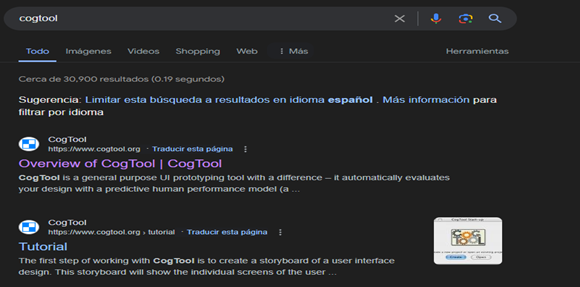

### Paso 2: Selecciona la versión adecuada 

Asegúrate de seleccionar la versión adecuada de CogTool para tu sistema operativo (Windows, macOS, Linux, etc.).  

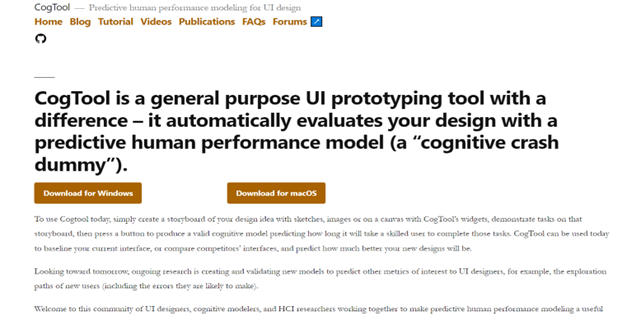

### Paso 3: Ejecuta el instalador 

Una vez descargado el archivo de instalación, ejecuta el instalador y sigue las instrucciones para instalar CogTool en tu computadora. 

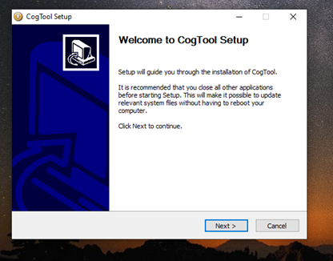

### Paso 4: Configura CogTool 

Después de instalar CogTool, configura el software según tus necesidades. Puedes encontrar documentación y recursos en el sitio web oficial de CogTool para ayudarte a configurar y utilizar el software (https://www.cogtool.org/). 

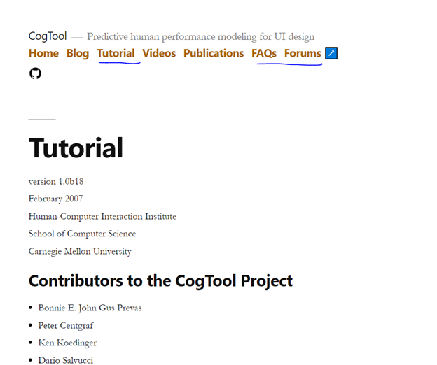

## ¿Cómo funciona?

### Paso 1. Inicialización de la aplicación 

Al inicializar la aplicación después de la instalación, no aparece la siguiente pantalla de bienvenida en el que nos da dos opciones: 

- **Open.** En este caso tenemos disponible la opción de abrir un proyecto ya existente, este puede ser el más reciente o abrir el Explorador de Windows para abrir un archivo .cgt y continuar algún proyecto. 
- **Create.** En caso contrario que no se cuente con un proyecto existente o se desea empezar uno completamente nuevo, esta opción nos deja realizar exactamente esto. 

Para los objetivos de la sesión práctica, se elige la opción Create para empezar un proyecto nuevo. 

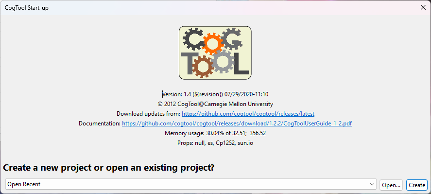
 

### Paso 2. Creación del nuevo proyecto 

Después de seleccionar la creación del nuevo proyecto, la pantalla de bienvenida se cierra y se abren dos pantallas, una con la lista de Tareas vacías y otra sobrepuesta que nos va a pedir información del nuevo proyecto 

En esta última pantalla nos pedirá información como: 

- El nombre del proyecto 
- Los dispositivos de entrada con los que interactuará el proyecto 
    - Teclado 
    - Ratón 
    - Pantalla “touch” 
    - Micrófono 
- Las entradas de salida 
    - Pantalla (seleccionada por default) 
    - Bocinas 

Para los objetivos de la práctica, se ingresa la información como se muestra en la siguiente captura: 

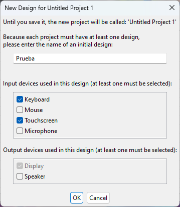

### Paso 3. La primera tarea 

Ahora que contamos con el proyecto nuevo, la herramienta cierra la ventana de creación del proyecto y crea automáticamente una nueva Tarea en la lista de Tareas previamente abierta. 

De igual manera, se abre automáticamente la Tarea recientemente creada y se muestra la pantalla siguiente: 

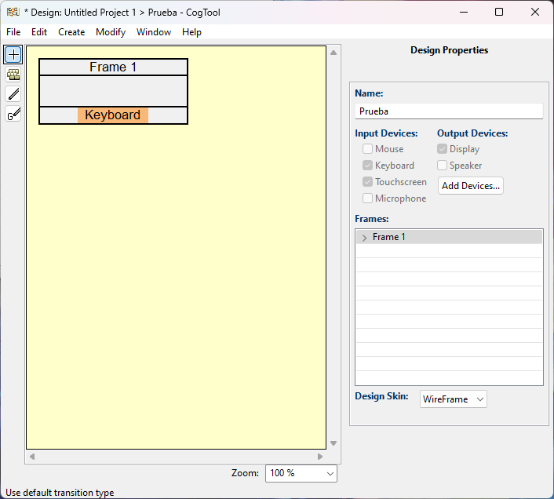

En esta pantalla podemos observar que existe por default un Frame el cual se puede considerar la primera pantalla de nuestro prototipo, así como información del diseño en una barra lateral como el nombre de la Tarea, la lista de Frames en l diseño, agregar Frame, etc. 

### Paso 4. Selección del Frame a trabajar. 

Con un clic al botón izquierdo del ratón, podemos seleccionar el Frame en donde vamos a realizar el primer prototipo.

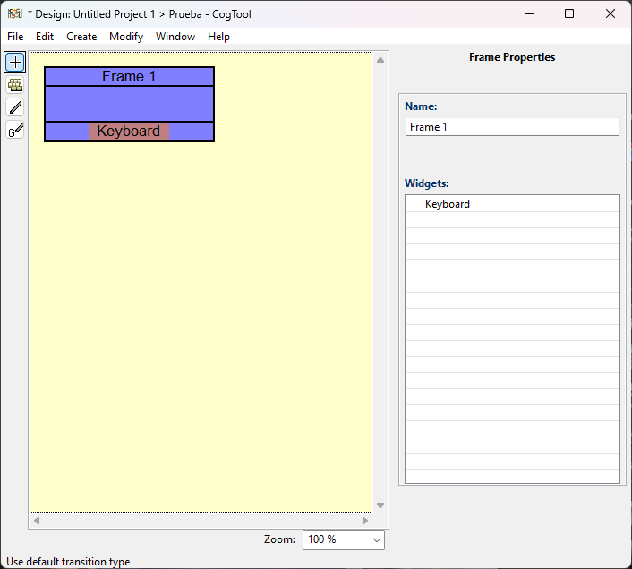
 

### Paso 5. Configurar la imagen de fondo. 

Después de haber seleccionado el Frame donde vamos a trabajar, ahora con el botón derecho del ratón abrimos el menú desplegable de opciones. 

En este menú seleccionamos la opción que dice “Set Background Image…” la cuál nos permite configurar una imagen como el fondo del Frame; esto con el objetivo de contar con los diseños relacionados con el proyecto dentro de la herramienta. 

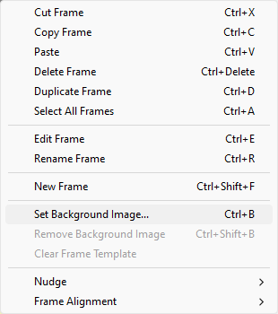
 

### Paso 6. Resultado y selección. 

Como resultado del paso anterior podemos observar en la captura siguiente la imagen de fondo en el Frame, de igual manera podemos observar que el Frame continúa seleccionado, esto nos ayudará en el paso siguiente. 

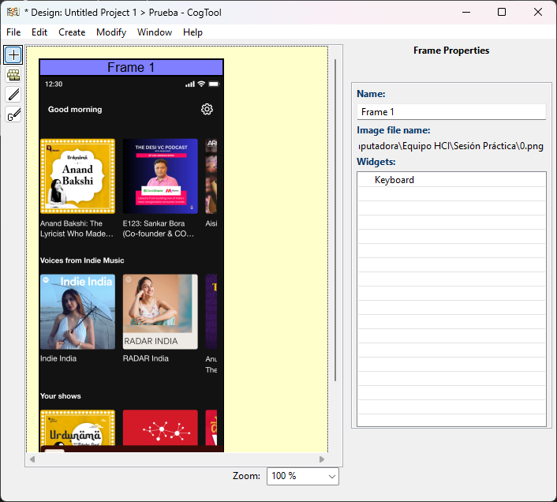

### Paso 7. Renombramiento del Frame 

El objetivo de este paso es el renombramiento del Frame actual, esto con el propósito de tener una menjor identificación de nuestras diferentes pantallas en el diseño. Por lo tanto, el paso únicamente nos indica un clic en el botón derecho del ratón con el cursor sobrepuesto en el área del Frame para volver a abrir el menú despegable donde ahora seleccionaremos la opción “Rename Frame” para entonces poder editar el nombre. 

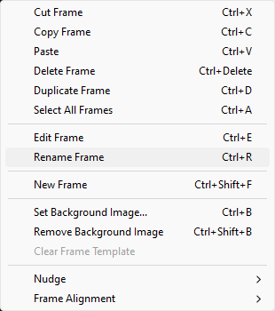

### Paso 8. Resultado del cambio de nombre 

En esta captura podemos ver cómo quedaría el resultado de nuestra edición  

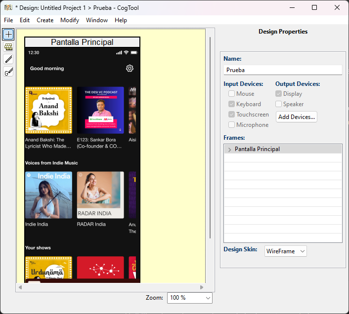

### Paso 9. Selecciona “Edit Frame” 

En este paso, se editará el Frame seleccionado para agregar los botones necesarios dentro de la imagen. Para ello, se realiza un clic con el botón derecho del ratón sobre el área del Frame y se selecciona la opción "Edit Frame" del menú desplegable. Esto abrirá una nueva ventana que permite la edición del Frame. 

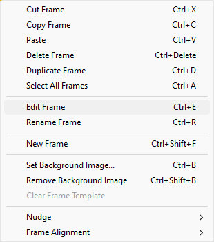

### Paso 10. Agregar Botones 

Una vez abierta la ventana de edición, se identifica la barra lateral izquierda de la interfaz. En dicha barra se encuentra un botón con el nombre "Button Widget". Al hacer clic en este botón, se activa la herramienta para agregar botones al Frame. 

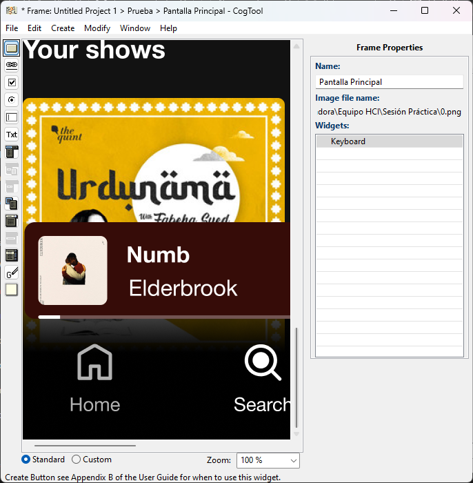

### Paso 11. Colocar Botones 

Con el botón "Button Widget" seleccionado, se procede a marcar el área donde se desea colocar el botón en el Frame. Esta acción se realiza con el cursor del ratón sobre la imagen del Frame, marcando la posición y dimensiones del botón que se quiere agregar. 

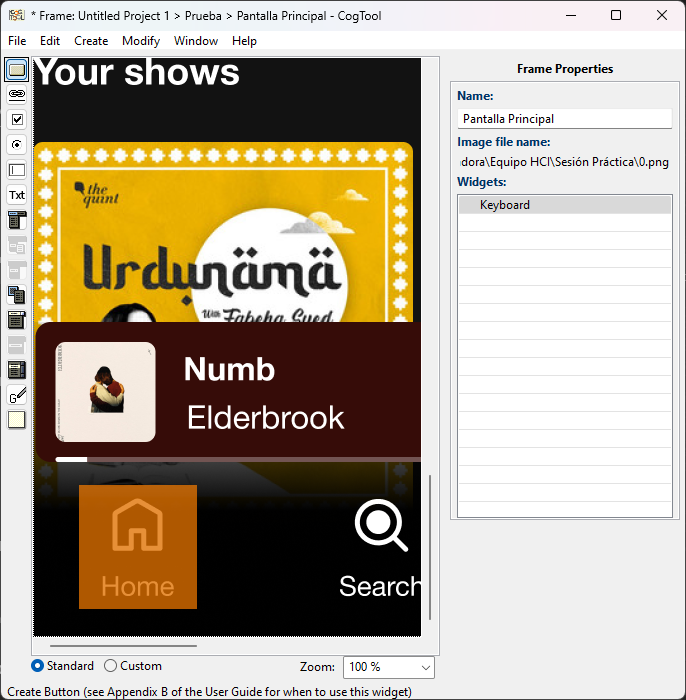
 

### Paso 12. Renombrar Botones 

Después de haber creado el "Button Widget" con el área definida, es necesario nombrarlo adecuadamente. En este paso, se selecciona el botón recién creado en el Frame y se le asigna un nombre que describa su función o contenido. Este nombre se puede editar directamente en la ventana de edición, modificando el texto que aparece en el cuadro de texto ubicado en la zona derecha de la interfaz. Para el ejemplo actual, el botón se llamará "Botón: Home".

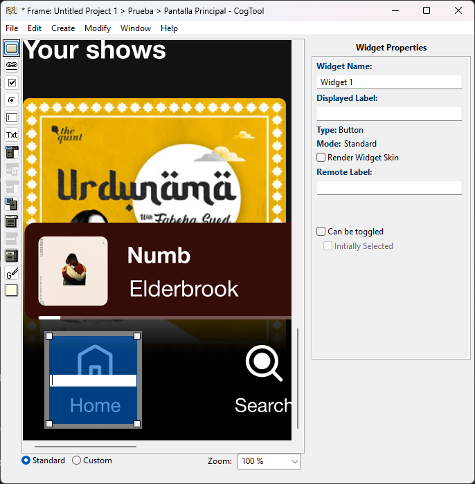

### Paso 13. Crea Todos los Botones Deseados 

Se repite el proceso descrito en el paso 12 para crear todos los botones que se requieran dentro del Frame. Se selecciona nuevamente el botón "Button Widget" en la barra lateral izquierda y se repite el proceso de selección del área del botón y la asignación del nombre correspondiente. Es importante utilizar un sistema de nombres claro y descriptivo que permita identificar fácilmente la función o el contenido de cada botón. 

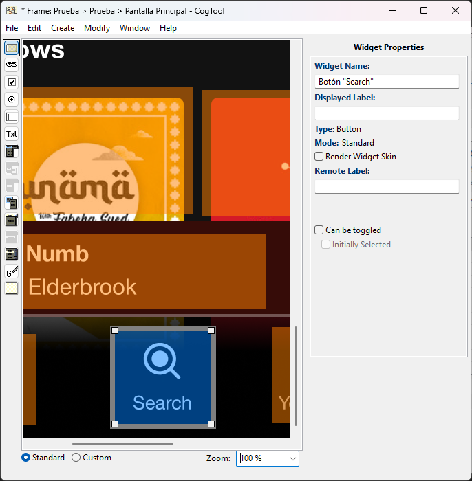

### Paso 14.  Verificación de la Creación de los Botones 

Al finalizar la creación de todos los botones y la asignación de nombres adecuados, la ventana de edición mostrará el Frame con los botones en pantalla y la lista de botones con sus nombres en la zona derecha de la interfaz. Se revisa que la información sea correcta y se cierra la ventana de edición, lo que devolverá la vista del Frame principal con los botones incorporados. 

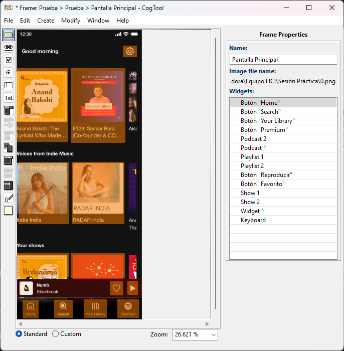

### Paso 15. Información del Frame 

Tras cerrar la ventan a de edición, se vuelve a la vista principal de CogTool. Se deselecciona el Frame principal haciendo clic en cualquier área fuera de su borde. En este punto, se observarán los botones que se crearon dentro del Frame y se podrá comprobar que están contenidos dentro de sus límites. En la parte derecha de la interfaz, una lista desplegable mostrará la información del Frame principal y los botones que contiene. 

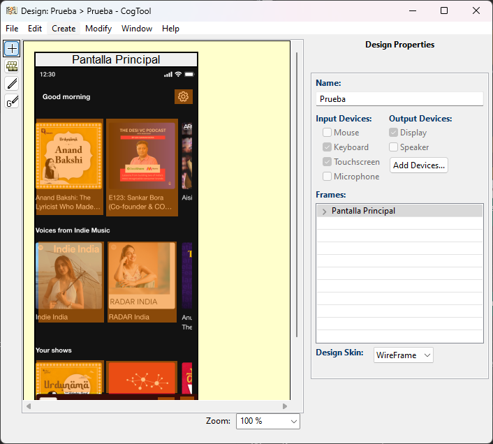
 

### Paso 16. Selecciona “New Frame” nuevamente 

Con el Frame principal ya creado, se procede a crear los Frames adicionales que se necesiten para el prototipo. Para ello, se hace clic con el botón derecho del ratón en un área fuera del primer Frame y se selecciona la opción "Add Frame". Se repiten los pasos del 5 al 15 para cada nuevo Frame, incluyendo la configuración de la imagen de fondo, la edición del nombre, la adición de botones y la confirmación de los cambios, esto se repite para la cantidad de frames que vayamos a usar. 

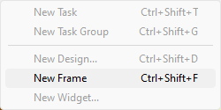

 

### Paso 17.  Ajustar la Visualización de los Frames 

Después de crear todos los Frames necesarios para el prototipo, la interfaz de CogTool mostrará una ventana similar a la imagen. En este ejemplo, se tienen cuatro Frames: "Pantalla Principal", "Pantalla search", "Pantalla resultados" y "Pantalla artista/grupo". Se pueden utilizar los controles de zoom para ajustar la visualización de las pantallas y observar correctamente su contenido y disposición. 

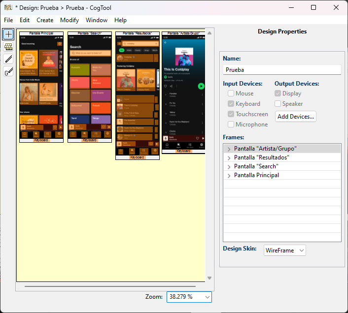

 

### Paso 18. Habilitar Transición Entre Frames 

En la barra lateral izquierda de la interfaz de CogTool, se selecciona el botón "Use touchscreen transition". Esta herramienta facilita la conexión de los botones con las pantallas correspondientes, permitiendo la creación de transiciones entre los diferentes Frames.

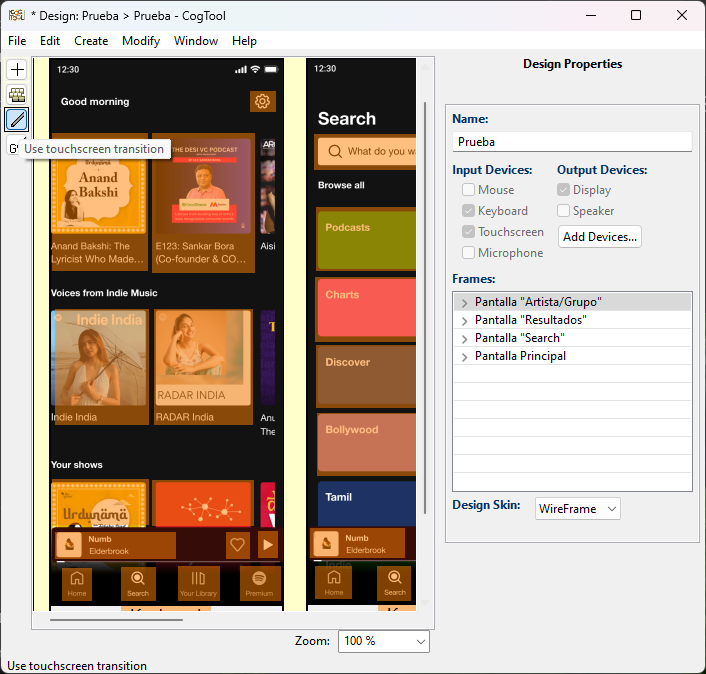

### Paso 19. Añadir Transiciones 

Con la herramienta de transición seleccionada, se añaden las transiciones necesarias entre los botones y las pantallas correspondientes. En este ejemplo, se conecta el "Botón buscar" con la "Pantalla buscar". Para ello, se hace clic en el botón "Botón buscar" dentro del Frame "Pantalla Principal" y se arrastra el cursor hasta el Frame "Pantalla buscar". Se repite este proceso para añadir las transiciones de los demás botones. 

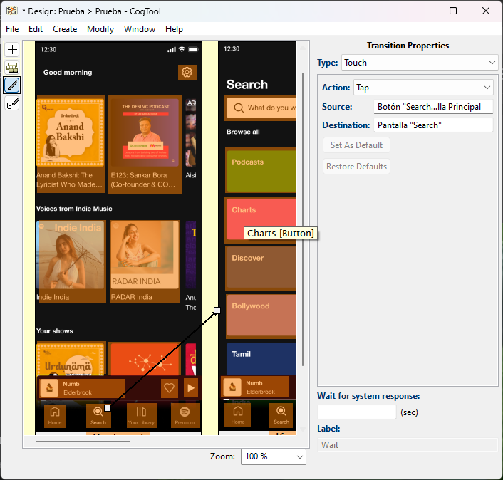

### Paso 20. Seleccionar Herramienta “Use Keyboard Transition” 

En este paso, vamos a seleccionar la herramienta "Use keyboard transition" de CogTool, la cual nos permitirá conectar la barra de búsqueda que acabamos de crear con su respectiva pantalla. Esta herramienta facilita la creación de transiciones entre los diferentes Frames de nuestro prototipo. Para ello, en la barra lateral izquierda de la interfaz de CogTool, localiza el botón "Use keyboard transition" y haz clic en él. Con esto, la herramienta estará seleccionada y lista para ser utilizada en el siguiente paso para conectar la barra de búsqueda con su pantalla. 

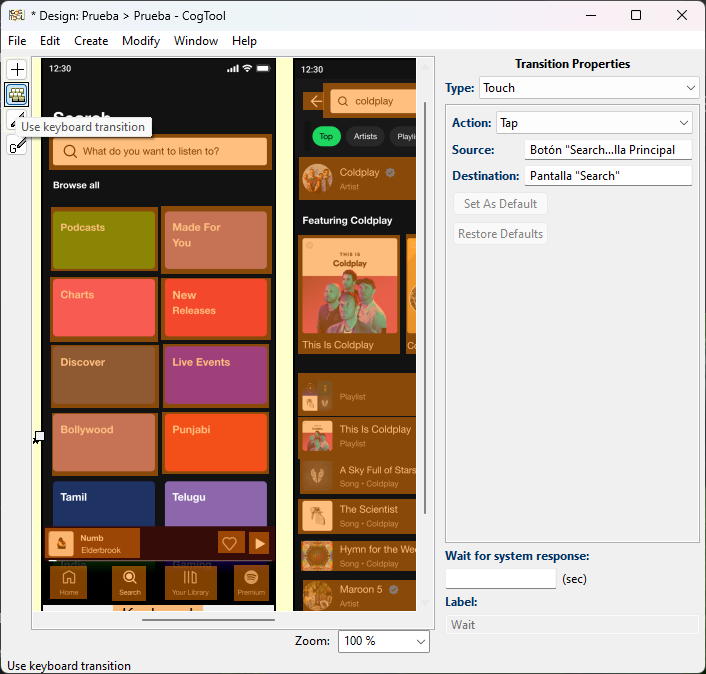

### Paso 21. Conectar Barra de Búsqueda 

Ahora que tenemos la herramienta "Use keyboard transition" seleccionada, vamos a conectar la barra de búsqueda con la pantalla que deseas. Para ello, haz clic en la barra de búsqueda y, manteniendo el clic presionado, arrastra el cursor hasta la pantalla deseada. Suelta el clic cuando la barra de búsqueda esté sobre la pantalla a la que quieres que se conecte. Por ejemplo, si quieres conectar la barra de búsqueda con la "Pantalla resultados", arrastra el cursor hasta que la barra de búsqueda esté sobre la "Pantalla resultados" y suelta el clic. Al realizar esta acción, se mostrará una nueva ventana donde se te pedirá que agregues el texto que se requerirá para realizar la transición. 

### Paso 22. “Renombrar Transición” 

En el campo de texto que apareció, escribe el texto que quieres usar para activar la transición. En este ejemplo, vamos a usar "coldplay" para que al escribir "coldplay" en la barra de búsqueda, la aplicación pase a la pantalla que elegiste en el paso anterior. 

Además, en el campo de texto "Wait for system response", ingresa un valor de 0.5 segundos. Este valor indica el tiempo que la aplicación esperará antes de procesar la transición después de que el usuario haya escrito el texto que activa la transición. 

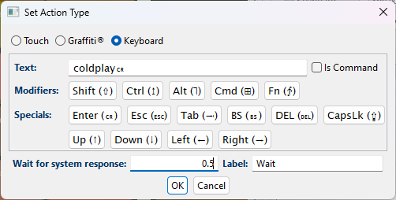

### Paso 23. Añadir Transiciones Adicionales 

En el caso de este ejemplo, para conectar el "Botón álbum de Coldplay" con la "Pantalla artista/grupo", vamos a repetir los pasos 21 y 22 que se utilizaron para conectar el "Botón buscar" con la "Pantalla buscar". Recuerda que estos pasos son específicos para este ejemplo y debes adaptarlos según las conexiones que desees crear en tu prototipo. En la barra lateral izquierda de la interfaz de CogTool selecciona el botón "Use touchscreen transition" Haz clic en el "Botón álbum de Coldplay" dentro de la pantalla en la que se encuentra por ejemplo la "Pantalla resultados" y arrastra el cursor hasta la "Pantalla artista/grupo" Suelta el clic cuando el botón esté sobre la "Pantalla artista/grupo" Con esto has conectado el "Botón álbum de Coldplay" con la "Pantalla artista/grupo" lo que significa que al hacer clic en el botón la aplicación pasará a la "Pantalla artista/grupo" 

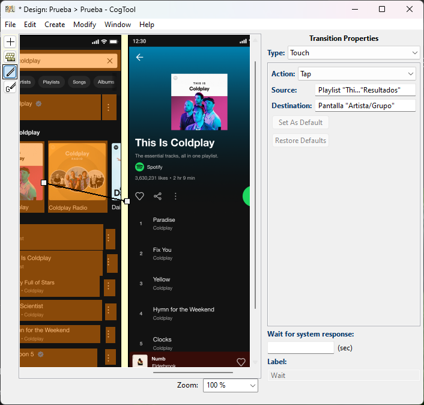

### Paso 24. Ajustar Tiempo de Respuesta del Sistema 

En las opciones de la derecha, encontrarás un campo de texto que dice "Wait for system response". En este campo, ingresa el valor "0.5 segundos".  Este valor determina el tiempo que la aplicación esperará antes de procesar la transición después de que el usuario haya hecho clic en el botón.  En este caso, la aplicación esperará medio segundo antes de pasar a la "Pantalla artista/grupo" una vez que el usuario haga clic en el "Botón álbum de Coldplay". 

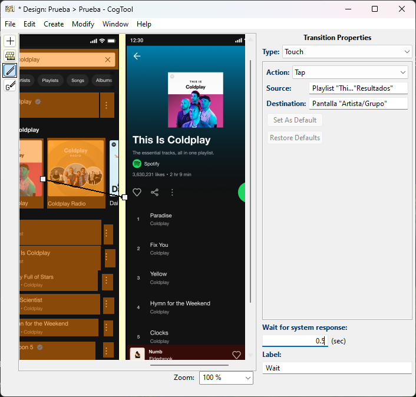
 

### Paso 25. Renombrar Tareas 

Regresa a la pantalla de tareas, la cual puedes encontrar en la ventana principal de CogTool. Ahí, verás la tarea que has estado trabajando, con todas las transiciones que has agregado hasta el momento. Para darle un nombre más descriptivo a la tarea que has creado, haz clic derecho sobre la tarea en la pantalla de tareas. 

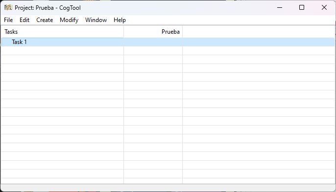

### Paso 26. Seleccionar “Rename Task” 

En el menú desplegable que aparece, selecciona la opción "Rename task". Aparecerá un campo de texto donde puedes escribir el nuevo nombre para la tarea. Escribe un nombre que describa claramente el contenido y el objetivo de la tarea que has creado 

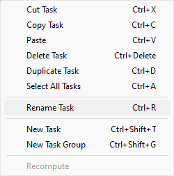

### Paso 27. Editar Tarea 

En nuestro ejemplo usaremos el nombre de "Buscar album coldplay", puedes usar un nombre descriptivo para la tarea a realizar 

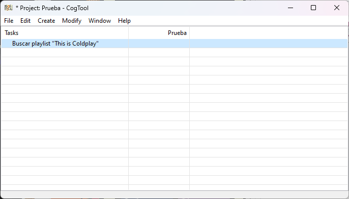

### Paso 28 

En la pestaña de pruebas, se observa que no hay información disponible. Esto se debe a que aún no se han realizado las pruebas de usabilidad para evaluar el rendimiento humano del prototipo. 

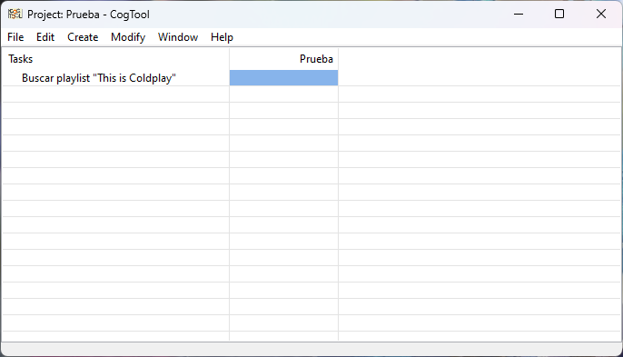

### Paso 29 

En este paso, con el botón derecho del ratón, seleccionamos la opción "Edit Script" del menú desplegable de la columna de pruebas en nuestra tarea. Esta acción nos lleva a una nueva ventana donde podemos editar el script de prueba de usabilidad. 

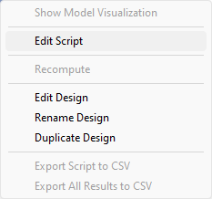

### Paso 30 

En este paso, se abrirá una nueva ventana para editar el script de prueba de usabilidad. Dentro de esta ventana, se nos solicitará seleccionar la pantalla principal del prototipo que hemos creado. En nuestro ejemplo, seleccionaremos la "Pantalla Principal" como la ventana inicial para realizar el script. 

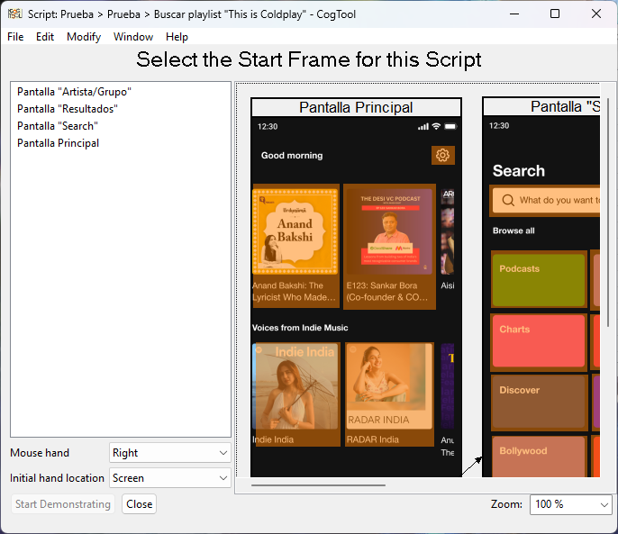

### Paso 31 

En este punto, el script se encuentra vacío, sin acciones definidas. La sección derecha de la ventana mostrará una lista vacía, indicando que aún no se han agregado interacciones del usuario. Es importante recordar que el script debe reflejar fielmente las acciones que un usuario real llevaría a cabo para completar la tarea objetivo. 

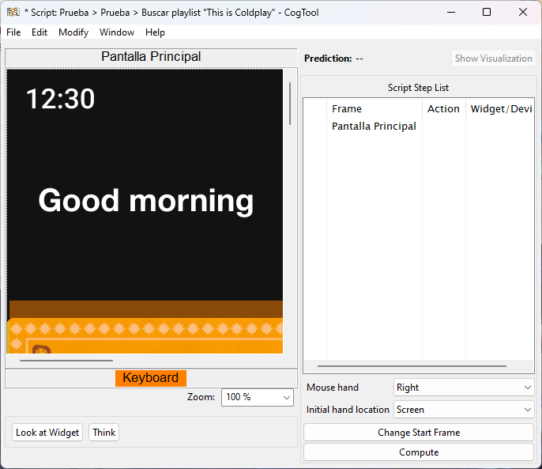

### Paso 32 

Una vez renombrado el elemento, dirigimos nuestra atención a la primera interacción con la interfaz. Considerando el comportamiento natural de un usuario al abrir la aplicación, es probable que su mirada se dirija inicialmente a la parte superior de la pantalla, donde se encuentra el podcast. Aunque el objetivo principal sea encontrar el álbum de Coldplay, la disposición visual del contenido puede llevar al usuario a observar primero el podcast, incluso si no es su intención inicial. 

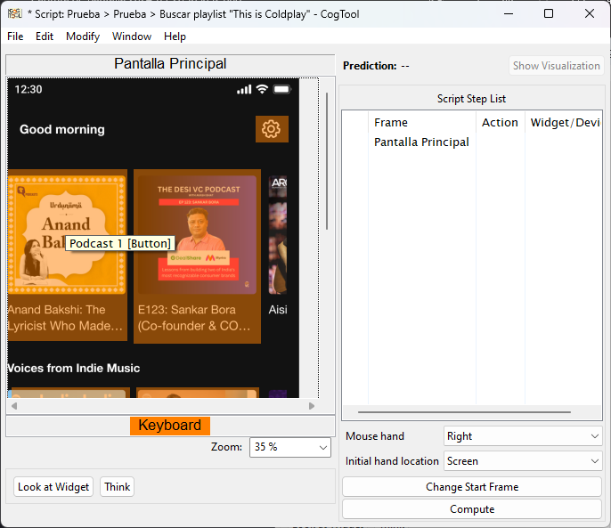

### Paso 33

Con el propósito de analizar el comportamiento del usuario y la posible distracción que un elemento en específico puede generar dentro del flujo de la tarea, se procede a seleccionar el botón que se considera como potencial distractor. Una vez identificado, se realiza un clic con el botón derecho del ratón sobre dicho botón, lo que desplegará un menú contextual con diversas opciones. Dentro de este menú, se selecciona la opción "Look at button", la cual nos permitirá simular la acción del usuario al enfocar su atención en dicho elemento. Es importante destacar que esta acción no ejecutará la transición asociada al botón, sino que únicamente registrará la mirada del usuario hacia este elemento. En el contexto particular de nuestro ejemplo, la acción se traduce en seleccionar "Look at Podcast 1", simulando la atención del usuario hacia el botón correspondiente 

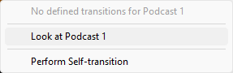

### Paso 34 

Tras llevar a cabo la acción previamente descrita, se observará una actualización en la lista de acciones a realizar dentro del script de la tarea. Concretamente, se habrá añadido una nueva entrada que refleja la acción de "mirar" el botón seleccionado como potencial distractor. Esta actualización en el script permitirá al modelo de CogTool considerar esta acción dentro del flujo de la tarea y, por ende, en el cálculo de las predicciones de tiempo y otros análisis de usabilidad. La presencia de esta acción en el script evidencia que la herramienta está registrando correctamente las interacciones del usuario con el prototipo, incluyendo aquellas que no implican una transición directa entre pantallas. 

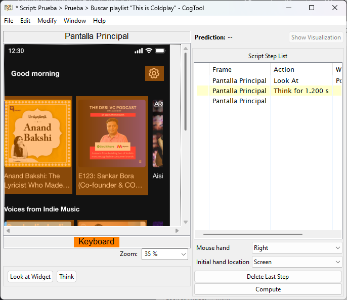

### Paso 35 

Para completar el análisis de potenciales distractores dentro de la interfaz y su impacto en el flujo de la tarea, se debe repetir el procedimiento descrito en el paso 36 de forma sistemática. Es decir, se deberá seleccionar cada uno de los botones que se considere como posible distractor para el usuario, hacer clic con el botón derecho del ratón sobre ellos y seleccionar la opción "Look at button" del menú contextual. Este proceso se repetirá hasta haber considerado todos los elementos que, según el diseño del prototipo y los objetivos de la tarea, puedan desviar la atención del usuario del camino óptimo para completar la tarea. Siguiendo el hilo conductor de nuestro ejemplo, este proceso iterativo se detendría al llegar al botón "Search", el cual representa la acción objetivo que se espera que el usuario realice en esta etapa de la tarea.  

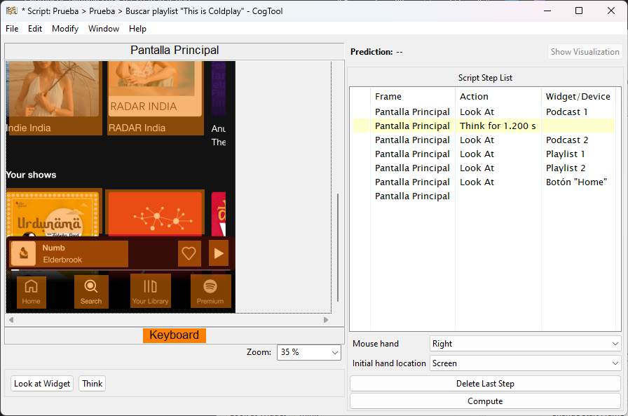

### Paso 36 

Después de haber simulado la atención del usuario hacia los potenciales distractores en la primera pantalla, finalmente hemos llegado al botón crucial para continuar con la tarea: el botón "Buscar". Para simular la acción del usuario al interactuar con este botón, procedemos a hacer clic derecho sobre él con el ratón. Esto desplegará un menú contextual con diferentes opciones, de entre las cuales seleccionaremos "Perform tap". Esta acción específica dentro de CogTool simula la pulsación sobre un botón en una interfaz táctil, representando de manera fidedigna la acción que realizaría un usuario real al usar nuestro prototipo. 

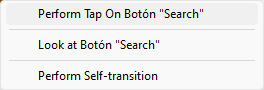

### Paso 37 

Tras haber navegado por la interfaz, simulando la atención del usuario a los potenciales distractores en la primera pantalla del prototipo, se alcanza la segunda ventana del diseño. En este punto, es crucial mantener la consistencia en el análisis y evaluar nuevamente la presencia de posibles elementos distractores. Siguiendo la lógica del paso 36, se debe examinar cuidadosamente la disposición de los elementos en esta nueva ventana y determinar si existe algún botón que pueda desviar la atención del usuario del flujo principal de la tarea. En el escenario específico de nuestro ejemplo, se realiza la observación de que la barra de búsqueda, elemento central para la siguiente acción del usuario, se encuentra ubicada en una posición destacada en la parte superior de la pantalla. Con base en este análisis visual y la jerarquía de elementos, se formula la hipótesis de que es poco probable que el usuario se distraiga con otros botones presentes en esta pantalla antes de interactuar con la barra de búsqueda. 

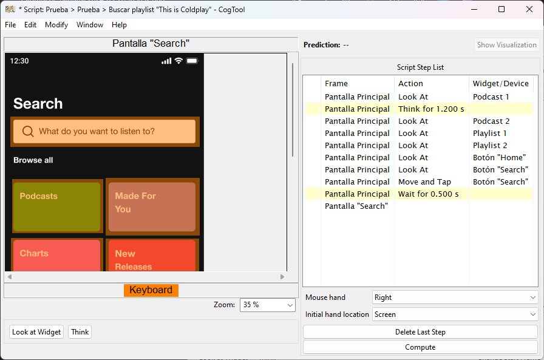

### Paso 38 

Una vez que el análisis de potenciales distractores en la segunda pantalla del prototipo ha concluido, se procede a simular la acción principal que se espera que el usuario realice en esta etapa de la tarea. En nuestro caso, el elemento central es la barra de búsqueda, por lo que se debe dirigir la atención del modelo hacia ella. Para lograr esto, se realiza un clic con el botón derecho del ratón sobre la barra de búsqueda, desplegando así el menú contextual de opciones. A diferencia del paso anterior, donde se seleccionaba "Look at button" para simular la mirada, en esta ocasión se selecciona la opción "Perform type". Esta acción específica se utiliza para simular la interacción del usuario al ingresar texto dentro de un campo de entrada, como lo es la barra de búsqueda en este caso. De esta manera, el modelo de CogTool podrá registrar y analizar no solo la navegación visual del usuario a través de la interfaz, sino también la ejecución de acciones concretas dentro del flujo de la tarea. 
 
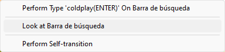

### Paso 39 

Tras haber simulado la acción del usuario al interactuar con la barra de búsqueda, la interfaz del prototipo nos presenta la siguiente etapa en el flujo de la tarea. Siguiendo la lógica establecida en los pasos previos, es esencial repetir el análisis de potenciales elementos distractores antes de continuar. En este caso particular, el objetivo principal es alcanzar el botón que representa el álbum de Coldplay, el cual se asume como la siguiente acción crucial dentro del flujo de la tarea. Por lo tanto, se debe examinar cuidadosamente la disposición de los elementos en esta nueva pantalla, identificando cualquier botón que pueda desviar la atención del usuario antes de llegar al objetivo final. Este análisis, similar al realizado en el paso 40, permitirá determinar si es necesario simular acciones de "mirar" botones adicionales utilizando la opción "Look at button", o si por el contrario, el camino hacia el álbum de Coldplay se encuentra libre de potenciales distracciones. 

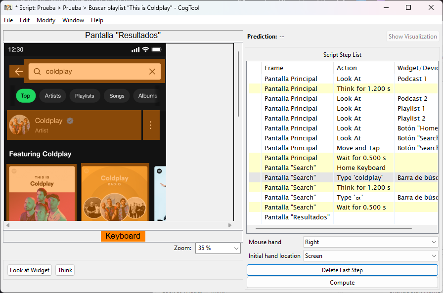

### Paso 40 

Tras haber realizado un minucioso análisis de la interfaz en busca de potenciales elementos distractores, y habiendo confirmado que el camino hacia el objetivo principal está despejado, se procede a simular la acción deseada en esta etapa de la tarea. En nuestro ejemplo, esto implica interactuar con el botón que representa el álbum de Coldplay. Para simular la acción del usuario, se realiza un clic con el botón derecho del ratón sobre dicho botón, desplegando así el menú contextual con las opciones disponibles. De entre las opciones, se selecciona "Perform tap", acción que simula la pulsación táctil sobre un botón en la interfaz. Con esta acción, el modelo de CogTool registra la interacción del usuario con el botón deseado, lo que le permitirá continuar con el flujo de la tarea y avanzar hacia la siguiente pantalla o etapa del prototipo. Es importante destacar que la elección de "Perform tap" como acción responde a la naturaleza del elemento con el que se interactúa, en este caso, un botón diseñado para ser pulsado. 

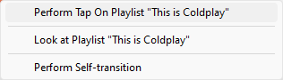

### Paso 41 

Para finalizar la simulación del flujo de la tarea dentro de CogTool, se debe repetir el proceso descrito en los pasos anteriores de manera iterativa hasta alcanzar el punto final deseado. Esto implica navegar por las diferentes pantallas del prototipo, analizando la presencia de posibles distractores en cada etapa y simulando las acciones del usuario utilizando las opciones "Look at button" y "Perform tap" (u otras acciones disponibles según el tipo de elemento) dependiendo de si se trata de un elemento que puede desviar la atención o del objetivo principal en cada pantalla. Siguiendo el hilo conductor de nuestro ejemplo, una vez que se ha simulado la acción de "pulsar" el botón del álbum de Coldplay, se asume que se ha alcanzado el objetivo final de la tarea: "Buscar álbum Coldplay". En consecuencia, la simulación habrá finalizado exitosamente, permitiéndonos proceder con el análisis de los resultados y las predicciones generadas por el modelo de CogTool. 
 
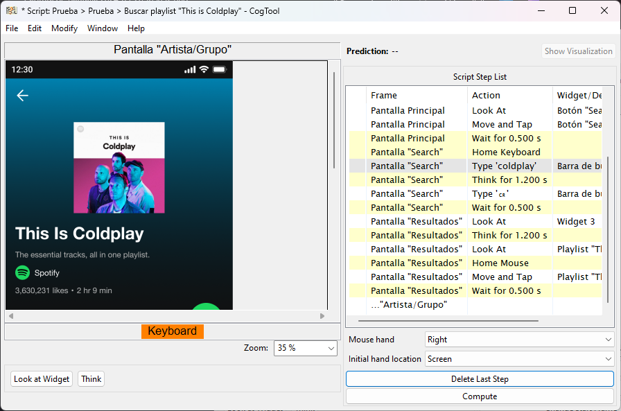

### Paso 42 

Con la simulación de la tarea completa, ha llegado el momento de aprovechar la capacidad de análisis predictivo que ofrece CogTool. Para ello, dirigimos nuestra atención al menú ubicado en la parte derecha de la interfaz. Dentro de este menú, encontraremos un botón con la etiqueta "Compute", el cual será nuestra herramienta para obtener la predicción del tiempo que un usuario promedio tardaría en completar la tarea simulada. Al hacer clic en este botón, el modelo de CogTool procesará toda la información recopilada durante la simulación, incluyendo la secuencia de acciones, las transiciones entre pantallas y los potenciales puntos de distracción. Tras un breve proceso de cálculo, la herramienta nos proporcionará una estimación del tiempo total, la cual se basa en el modelo cognitivo de procesamiento humano que incorpora CogTool. 

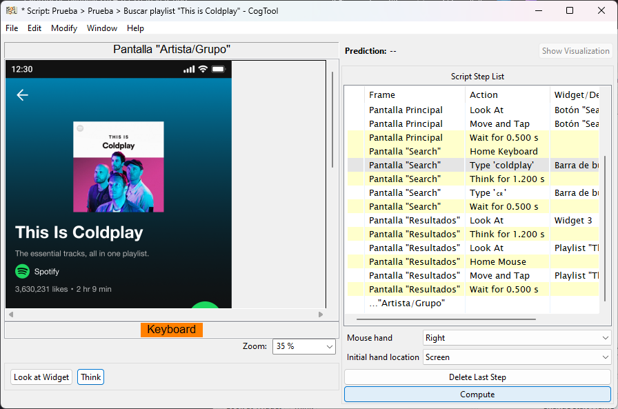

### Paso 43 

Tras haber iniciado el proceso de cálculo mediante el botón "Compute", solo queda esperar unos instantes mientras CogTool procesa la información de la simulación y realiza las predicciones correspondientes. En este punto, la herramienta aplica su modelo cognitivo interno, el cual se basa en principios de la psicología cognitiva para simular el comportamiento de un usuario humano frente a la interfaz. Una vez finalizado el análisis, CogTool nos presenta el resultado de su predicción. En el contexto particular de nuestro ejemplo, la herramienta estima que un usuario promedio tardaría "10.6" segundos en completar la tarea "Buscar álbum Coldplay" siguiendo el flujo de acciones que se ha definido durante la simulación. Este dato, aunque se trata de una aproximación, nos proporciona una valiosa referencia para evaluar la eficiencia del diseño de la interfaz y la facilidad con la que los usuarios pueden alcanzar su objetivo. 

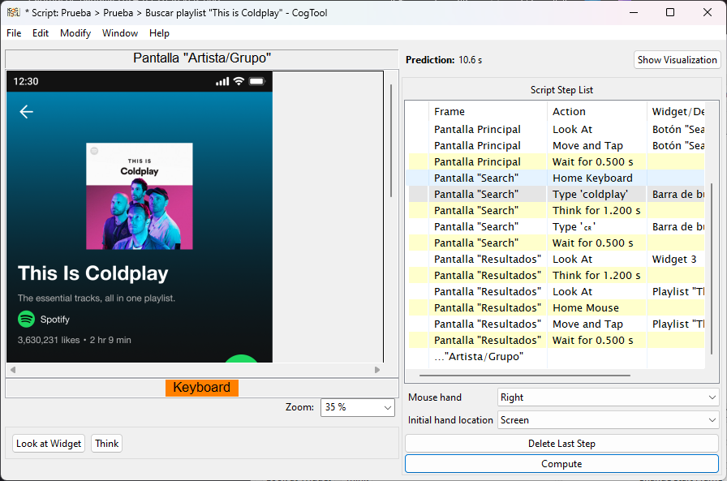

### Paso 44 

Una vez obtenida la predicción de tiempo proporcionada por CogTool, podemos cerrar la ventana de edición del script, la cual nos ha servido para definir la secuencia de acciones de la tarea. Al hacerlo, regresaremos a la ventana principal de tareas de CogTool. En esta ventana, observaremos que la tarea "Buscar álbum Coldplay", en la que hemos estado trabajando, ahora mostrará la predicción de tiempo calculada (en nuestro caso, "10.6" segundos) junto a su nombre. Esta información quedará almacenada y asociada a la tarea, lo que nos permitirá consultarla en cualquier momento posterior, incluso si cerramos y volvemos a abrir el proyecto en CogTool. De esta manera, podremos llevar un registro de las predicciones de tiempo para las diferentes tareas que definamos en nuestro prototipo, facilitando el análisis comparativo y la evaluación de la usabilidad a lo largo del proceso de diseño. 

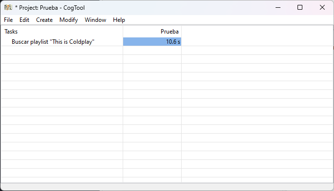

### Paso 45 

Con la primera tarea completada y su predicción de tiempo registrada, nuestro trabajo en CogTool no ha hecho más que comenzar. Ahora podemos aprovechar el conocimiento adquirido y la eficiencia de la herramienta para analizar otras tareas relevantes para nuestro prototipo. 

Para ello, simplemente debemos repetir el ciclo de trabajo que hemos seguido hasta ahora: definir una nueva tarea en la ventana principal, construir su flujo de acciones paso a paso en la ventana de edición de scripts (considerando posibles distractores y acciones principales), ejecutar el análisis predictivo haciendo clic en "Compute" y, finalmente, observar la predicción de tiempo generada. Este proceso iterativo nos permitirá obtener datos valiosos sobre la usabilidad de nuestro diseño para un conjunto de tareas representativas de la interacción real de los usuarios. De esta manera, CogTool se convierte en un aliado fundamental para tomar decisiones de diseño informadas y optimizar la experiencia de usuario en nuestro prototipo. 

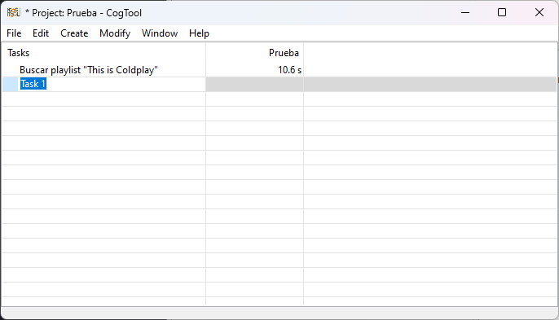