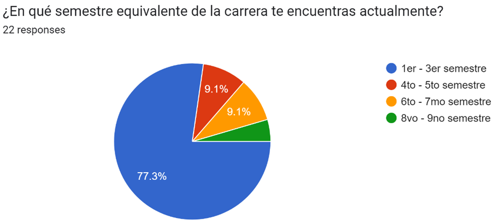
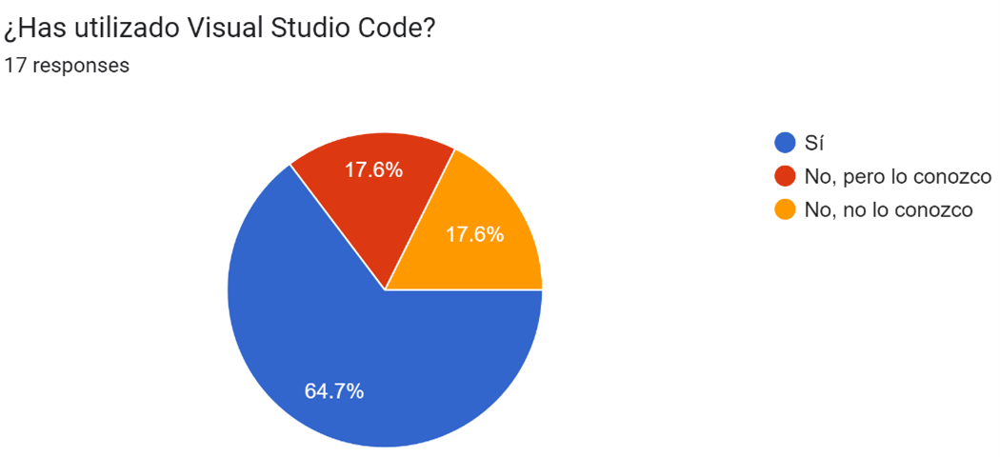
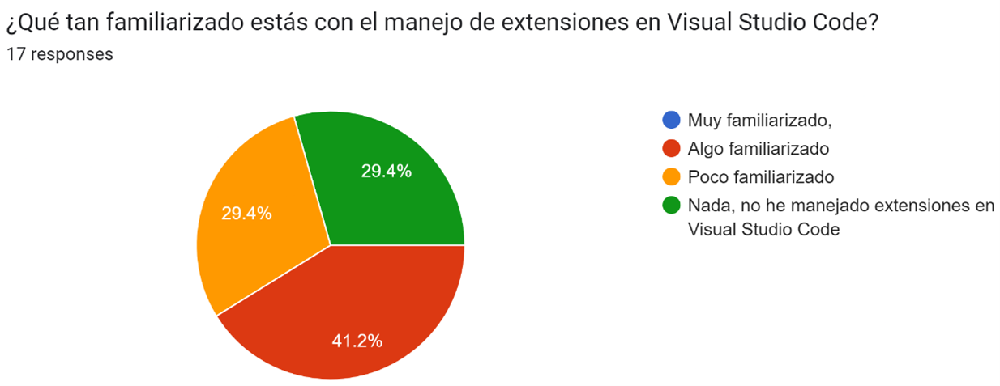
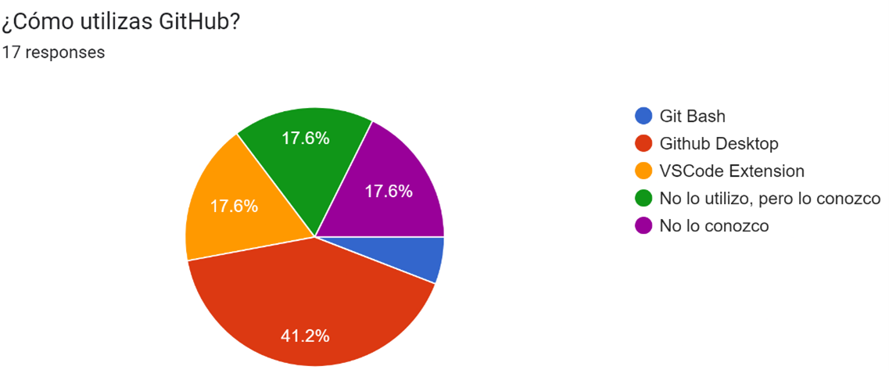
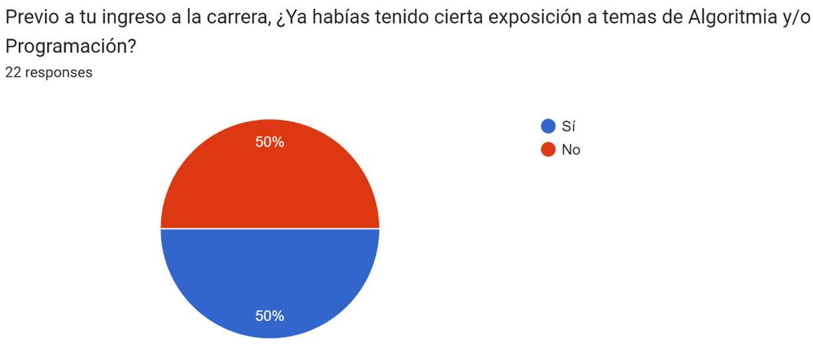
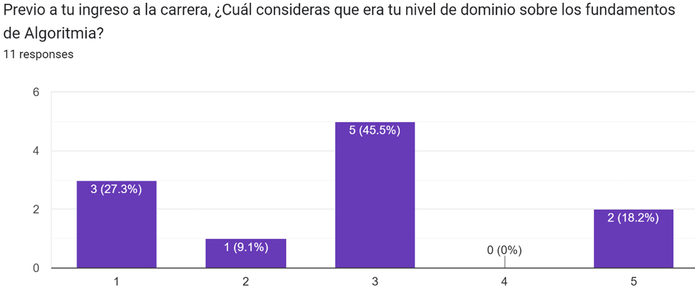
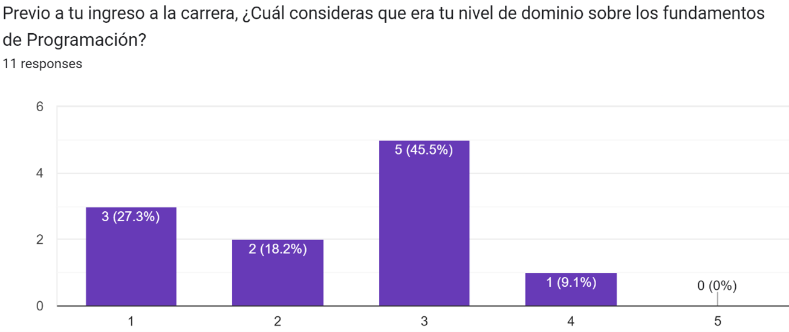
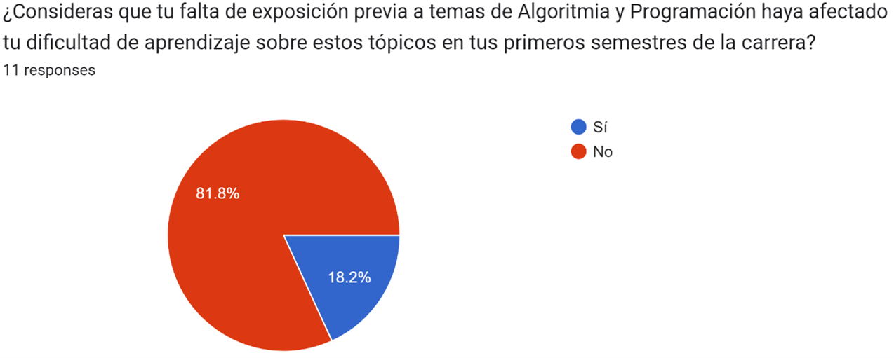
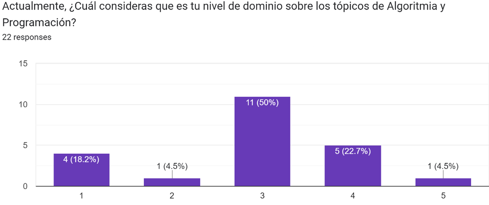
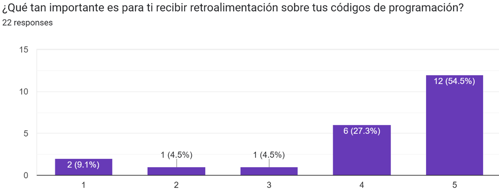

## Results Analysis

The following analysis is based on a survey with 22 responses and addresses the questions below:

Question for 1st semester students

Exploration of previous experience

Previous knowledge about Programming and Algorithmics subjects

Without exposure to Programming and Algorithmics subjects

Closure

**Who are the Users?**

While our target user base includes both students and professors within the first semester of the Mathematics Faculty, this specific survey focused solely on students enrolled in the Algorithmics and Basic Programming courses.

**How many Users are there?**

The estimated number of students who might benefit from the system is currently between 400 and 600. This quantity represents the amount of Bachelor of Software Engineering students in the Faculty of Mathematics. This number is still pending confirmation.

**What do they do with the System?**

The system is intended to help students streamline their programming tasks and gather data on their work process, including information such as errors encountered and time spent on tasks.

## Conclusion

Given the 6 students who answered that have not use Git on any form, we can use a really crude abstraction of the percentage 27.27% (6 of 22) of the population of users are our goal market who are the students that don't have a "knack" or experience with the tools currently used on the Test Runner.